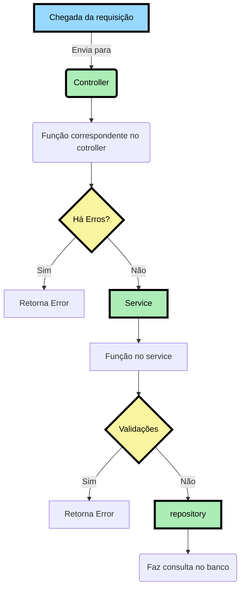
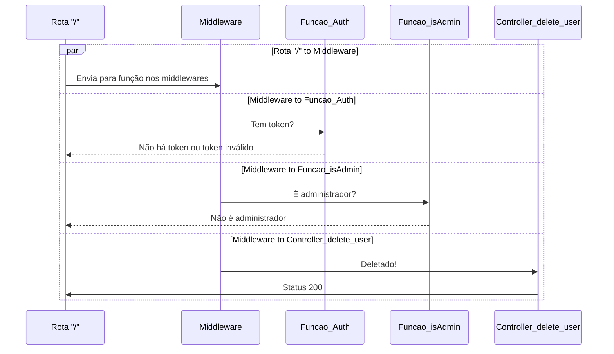

## Fluxo da Aplicação

## Fluxo para **Deletar usuário**

##

<h1> Regra de negócios </h1>

<table>
  <tr>
    <td align="center">
      
Entidades

    </td>
    <td align="center">
      
Descrição

    </td>
  </tr>
   <tr>
    <td align="center">
      
Usuário

    </td>
    <td>
      

        O Usuário poderá se cadastrar como cliente ou fornecedor.
      

      

        O Usuário terá email, senha, cpf ou cnpj, endereço. O telefone, nome social serão opcionais.
      

      

        O Usuário não poderá cadastrar o cpf ou cnpj caso já estejam cadastrados.
      

      

        O Usuário não poderá cadastrar um email caso já esteja cadastrado.
      

      

        O Usuário poderá alterar email, senha, endereço, telefone, porém não o seu nível de acesso e cpf ou cnpj.
      

    </td>
  </tr>
  <tr>
    <td align="center">
      
Administrador

    </td>
    <td>
      

        O Administrador do sistema pode cadastrar outros administradores, fornecedores e clientes.
      

      

        O Administrador poderá adicionar suas próprias postagens, comentários, assim como apagar e editar.
      

      

        O Administrador poderá bloquear usuários, arquivar comentários e postagens denunciados.
      

      

        O Administrador poderá alterar o nível de <strong>qualquer</strong> usuário.
      

      

        O sistema deverá iniciar com um Administrador primordial (Adão).
      

      

        Haverá uma validação para que o Administrador (Adão) não possa ser deletado do sistema através do seu ID.
      

    </td>
  </tr>
  <tr>
    <td align="center">
      
Fornecedor

    </td>
    <td>
      

        O Fornecedor poderá criar suas próprias postagens e comentar outras.
      

      

        O Fornecedor poderá denunciar comentários e postagens.
      

      

        O Fornecedor poderá editar suas postagens e comentários.
      

      

        O Fornecedor que tiver sua conta desativada, terá o atributo "ativo" como false, assim como seus comentários e produtos postados.
      

    </td>
  </tr>
    <tr>
    <td align="center">
      
Cliente

    </td>
    <td>
      

        O Cliente poderá criar suas próprias postagens e comentar outras.
      

      

        O Cliente poderá denunciar comentários e postagens.
      

      

        O Cliente poderá editar suas postagens e comentários.
      

      

        O Cliente que tiver sua conta desativada, terá o atributo "ativo" como false, assim como seus comentários e produtos postados.
      

    </td>
  </tr>
  <tr>
    <td align="center">
      
Produtos

    </td>
    <td>
      

        O Produto deverá ter um nome, ingredientes. A imagem é opcional.
      

      

        O Produto iniciará com o atributo "status" como null, caberá ao Administrador avalia-lo entre "true" ou "false".
      

      

        O Produto, ao ser postado pelo usuário, terá uma data de postagem como atributo, e também, o atributo "editado" para mostrar caso haja alteração na postagem.
      

      

        O Produto só poderá ser listado e apresentado no site caso possua o atributo "status" como null ou true.
      

      

        O Produto só poderá denunciado caso seu atributo "status" seja null.
      

      

        O Produto receberá inicialmente o atributo "feedbacks_produto" como 0, e caso receba like terá seu valor incrementado.
      

      

        O Produto possuirá um atributo chamado "id_aprovado" recebendo o valor do ID do Administrador responsável por aprova-lo.
      

    </td>
  </tr>
  <tr>
    <td align="center">
      
Comentário

    </td>
    <td>
      

        O Comentário deverá possuir uma mensagem.
      

      

        O Comentário ao ser feito, terá os atributos "status", "data_comentario", "editado" e "id_aprovado".
      

      

        O Comentário iniciará com o atributo "status" como null, caberá ao Administrador avalia-lo entre "true" ou "false".
      

      

        O Comentário iniciará com o atributo "editado" como false, se tornando true ao ser editado pela primeira vez.
      

      

        O Comentário não possuirá número mínimo de caracteres, porém deverá possuir 140 caracteres no máximo.
      

      

        O Comentário terá o atributo "feedbacks_comentarios" iniciado como 0, e se caso receber like terá seu valor incrementado.
      

      

        O Comentário possuirá um atributo chamado "id_aprovado" recebendo o valor do ID do Administrador responsável por aprova-lo.
      

    </td>
  </tr>
</table>

## Ações a Fazer

- **O sistema deverá iniciar com um Administrador primordial (Adão).**
- **Haverá uma validação para que o Administrador (Adão) não possa ser deletado do sistema através do seu ID.**

### Usuário
- [ok] : Cadastrar usuário
- [ok] : Listagem de usuário
- [ok] : Atualização de usuário
- [ok] : O Usuário não poderá cadastrar o cpf ou cnpj caso já estejam cadastrados.
- [ok] : O Usuário não poderá cadastrar um email caso já esteja cadastrado.
- [ok] : O Usuário poderá alterar email, senha, endereço, telefone, porém não o seu nível de acesso e cpf ou cnpj não.
- [--] : O Usuário poderá adicionar suas próprias postagens, comentários
- [--] : O Usuário poderá denunciar comentários e postagens.
- [--] : O Usuário poderá editar suas postagens e comentários.

### Administrador
- **Todos tem um middleware isAdmin**
- [ok] : O Administrador do sistema pode transformar um usuário em ADMIN. **Criar rota, terá uma validação de administrador, ou seja Middleware isAdmin**
- [--] : O Administrador poderá adicionar apagar e editar.        
- [--] : O Administrador poderá arquivar comentários  
- [--] : O Administrador poderá bloquear postagens denunciados.
- [ok] : Deixar usuário inativo (Delete)
- [ok] : O Administrador poderá alterar o nível de qualquer usuário.
- [--] : Aprovar produto **Quando o prdiduto estive aprovado, terá o id_aprovado, que será o id do administrador que aprovou**
### Fornecedor
- [--] : Poderá denunciar comentários e postagens.
- [--] : Poderá editar suas postagens e comentários.

### Cliente
- [ok] : O Cliente que tiver sua conta desativada, terá o atributo "ativo" como false, assim como seus comentários e produtos postados.

### Produtos
- [ok] : Criar produto
- [ok] : Listar produto apenas aqueles com status **diferentes de false**
- [--] : Atualizar produto
- [--] : Deletar/Denunciar produto **Setar Status para false**    **Terá validação, ou seja, Middleware isAdmin**
- [--] : Função rota para incrementar "feedbacks_produto" inicia com 0.

### Comentário
- [--] : Criar comentário
- [--] : Deletar comentário **Setar status para false**
- [--] : Atualizar comentário
- [--] : Listar comentário
- [--] : Denunciar comentário **Setar para false**
- [--] : Função rota para atualizar id_aprovado com o id do **ADMIN** quando aprovado **Apenas Admins podem aprovar** 
- [--] : Função rota para incrementar "feedbacks_produto" inicia com 0.

