## Configurando e inicializando o projeto

Primeiramente deverá fazer o clone da aplicação em sua máquina:

Através do https
```
    git clone https://github.com/stack-over-code-atlantico/supermercadosq-be.git
```

Através do ssh
```
    git clone git@github.com:stack-over-code-atlantico/supermercadosq-be.git
```

Utilizamos o `npm install` para instalar todas as depedências utilizadas no projeto.

```
    npm install 
```
Para essa próxima etapa é necessário ter o arquivo `.env` configurado

Logo após a instalação, utilizamos o `npx prisma generate` para inicilizar e gerar um cliente prisma. 
```
    npx prisma generate
```

O próximo passo é utilizar o comando `npx prisma migrate dev --name init` para manter o seu arquivo `prisma.schema` sincronizado com o banco de dados.
```
    npx prisma migrate dev --name init
```

E, por fim, usamos o `npm run dev` para iniciar o servidor em modo de desenvolvimento utilizando a biblioteca `nodemon` no endereço: [http://localhost:3000](http://localhost:3000)
```
    npm run dev
```

## Dependências

<ul>
    <li>
        <a href="https://www.prisma.io/docs/concepts/components/prisma-client">
            @prisma/client
        </a>
    </li>
    <li>
        <a href="https://www.npmjs.com/package/bcrypt">
            bcrypt
        </a>
    </li>
    <li>
        <a href="https://expressjs.com/pt-br/">
            express
        </a>
    </li>
    <li>
        <a href="https://www.npmjs.com/package/express-async-errors">
            express-async-errors
        </a>
    </li>
    <li>
        <a href="https://jwt.io/introduction">
            jsonwebtoken
        </a>
    </li>
    <li>
        <a href="https://www.npmjs.com/package/module-alias">
            module-alias
        </a>
    </li>
    <li>
        <a href="https://www.npmjs.com/package/uuid">
            uuid
        </a>
    </li>
</ul>

## Depedências de desenvolvimento
<ul>
    <li>
        <a href="https://www.npmjs.com/package/nodemon">
            nodemon
        </a>
    </li>
    <li>
        <a href="https://www.prisma.io/">
            prisma
        </a>
    </li>
</ul>

## Arquitetura de Pastas do Backend


## Fluxo da Aplicação

```mermaid
    flowchart TD
    A[Chegada da requisição] -->|Envia para| B(Controller)
    B(Controller) --> C(Função correspondente no cotroller)
    C --> D{Há Erros?}
    D --> |Sim| E[Retorna Error]
    D --> |Não| F[Service]
    F --> G[Função no service]
    G --> H{Validações}
    H --> |Sim| I[Retorna Error]
    H --> |Não| J[repository]
    J --> K(Faz consulta no banco)

    style A fill:#99d9ff,stroke:#000,stroke-width:4px,color:#000
    style B fill:#acecb6,stroke:#000,stroke-width:4px,color:#000
    style D fill:#f9f49f,stroke:#000,stroke-width:4px,color:#000
    style F fill:#acecb6,stroke:#000,stroke-width:4px,color:#000
    style H fill:#f9f49f,stroke:#000,stroke-width:4px,color:#000
    style J fill:#acecb6,stroke:#000,stroke-width:4px,color:#000
```


## Fluxo para **Deletar usuário**

```mermaid
    sequenceDiagram
    par Rota "/" to Middleware
        Rota "/"->>Middleware: Envia para função nos middlewares
    and Middleware to Funcao_Auth
        Middleware->>Funcao_Auth: Tem token?
        Funcao_Auth-->>Rota "/": Não há token ou token inválido
    and Middleware to Funcao_isAdmin
        Middleware->>Funcao_isAdmin: É administrador?
        Funcao_isAdmin-->>Rota "/": Não é administrador
    and Middleware to Controller_delete_user
        Middleware->>Controller_delete_user: Deletado!
        Controller_delete_user->>Rota "/": Status 200
    end
```



## Endpoints / Rotas

<h3>
    Usuários
</h3>

** Todas as informações nos endpoints entre parenteses "()" são os valores ou parâmetros

** Todas as informações nas requisições adicionadas do ícone "💹" são rotas que exigem autenticação.

<table>
  <tr>
    <td align="center">
      <p>Entidades</p>
    </td>
    <td align="center">
      <p>Ação</p>
    </td>
    <td align="center">
      <p>Requisição</p>
    </td>
    <td align="center">
      <p>Endpoint</p>
    </td>
  </tr>
   <tr>
    <td align="center">
      <p>Usuário</p>
    </td>
    <td align="center">
      <p>
          Listar todos os usuários
      </p>
      <p>
          Criar um novo usuário
      </p>
      <p>
          Atualizar as informações de um usuário
      </p>
      <p>
          Deletar o usuário (setar o valor do atributo "ativo": false)
      </p>
      <p>
          Alterar o nível de usuário (setar o valor do atributo "nivel": "ADMINISTRADOR" ou "CLIENTE" ou "FORNECEDOR")
      </p>
    </td>
    <td>
      <p>
          GET
      </p>
      <p>
          POST
      </p>
      <p>
          PUT
      </p>
      <p>
          PUT 💹
      </p>
      <p>
          PUT 💹
      </p>
    </td>
    <td>
      <p>
          /users
      </p>
      <p>
          /users
      </p>
      <p>
          /users/(cpf_cnpj)
      </p>
      <p>
          /users/(cpf_cnpj)/delete
      </p>
      <p>
          /users/(cpf_cnpj)/nivel_edit
      </p>
    </td>
  </tr>
  <tr>
    <td align="center">
    <p>Login</p>
    </td>
    <td>

    </td>
  </tr>
  <tr>
    <td align="center">
      <p>Fornecedor</p>
    </td>
    <td>

    </td>
  </tr>
    <tr>
    <td align="center">
      <p>Cliente</p>
    </td>
    <td>

    </td>
  </tr>
  <tr>
    <td align="center">
      <p>Produtos</p>
    </td>
    <td>

    </td>
  </tr>
  <tr>
    <td align="center">
      <p>Comentário</p>
    </td>
    <td>
    </td>
  </tr>
</table>


##

<h1> Regra de negócios </h1>

<table>
  <tr>
    <td align="center">
      <p>Entidades</p>
    </td>
    <td align="center">
      <p>Descrição</p>
    </td>
  </tr>
   <tr>
    <td align="center">
      <p>Usuário</p>
    </td>
    <td>
      <p>
        O Usuário poderá se cadastrar como cliente ou fornecedor.
      </p>
      <p>
        O Usuário terá email, senha, cpf ou cnpj, endereço. O telefone, nome social serão opcionais.
      </p>
      <p>
        O Usuário não poderá cadastrar o cpf ou cnpj caso já estejam cadastrados.
      </p>
      <p>
        O Usuário não poderá cadastrar um email caso já esteja cadastrado.
      </p>
      <p>
        O Usuário poderá alterar email, senha, endereço, telefone, porém não o seu nível de acesso e cpf ou cnpj.
      </p>
    </td>
  </tr>
  <tr>
    <td align="center">
      <p>Administrador</p>
    </td>
    <td>
      <p>
        O Administrador do sistema pode cadastrar outros administradores, fornecedores e clientes.
      </p>
      <p>
        O Administrador poderá adicionar suas próprias postagens, comentários, assim como apagar e editar.
      </p>
      <p>
        O Administrador poderá bloquear usuários, arquivar comentários e postagens denunciados.
      </p>
      <p>
        O Administrador poderá alterar o nível de <strong>qualquer</strong> usuário.
      </p>
      <p>
        O sistema deverá iniciar com um Administrador primordial (Adão).
      </p>
      <p>
        Haverá uma validação para que o Administrador (Adão) não possa ser deletado do sistema através do seu ID.
      </p>
    </td>
  </tr>
  <tr>
    <td align="center">
      <p>Fornecedor</p>
    </td>
    <td>
      <p>
        O Fornecedor poderá criar suas próprias postagens e comentar outras.
      </p>
      <p>
        O Fornecedor poderá denunciar comentários e postagens.
      </p>
      <p>
        O Fornecedor poderá editar suas postagens e comentários.
      </p>
      <p>
        O Fornecedor que tiver sua conta desativada, terá o atributo "ativo" como false, assim como seus comentários e produtos postados.
      </p>
    </td>
  </tr>
    <tr>
    <td align="center">
      <p>Cliente</p>
    </td>
    <td>
      <p>
        O Cliente poderá criar suas próprias postagens e comentar outras.
      </p>
      <p>
        O Cliente poderá denunciar comentários e postagens.
      </p>
      <p>
        O Cliente poderá editar suas postagens e comentários.
      </p>
      <p>
        O Cliente que tiver sua conta desativada, terá o atributo "ativo" como false, assim como seus comentários e produtos postados.
      </p>
    </td>
  </tr>
  <tr>
    <td align="center">
      <p>Produtos</p>
    </td>
    <td>
      <p>
        O Produto deverá ter um nome, ingredientes. A imagem é opcional.
      </p>
      <p>
        O Produto iniciará com o atributo "status" como null, caberá ao Administrador avalia-lo entre "true" ou "false".
      </p>
      <p>
        O Produto, ao ser postado pelo usuário, terá uma data de postagem como atributo, e também, o atributo "editado" para mostrar caso haja alteração na postagem.
      </p>
      <p>
        O Produto só poderá ser listado e apresentado no site caso possua o atributo "status" como null ou true.
      </p>
      <p>
        O Produto só poderá denunciado caso seu atributo "status" seja null.
      </p>
      <p>
        O Produto receberá inicialmente o atributo "feedbacks_produto" como 0, e caso receba like terá seu valor incrementado.
      </p>
      <p>
        O Produto possuirá um atributo chamado "id_aprovado" recebendo o valor do ID do Administrador responsável por aprova-lo.
      </p>
    </td>
  </tr>
  <tr>
    <td align="center">
      <p>Comentário</p>
    </td>
    <td>
      <p>
        O Comentário deverá possuir uma mensagem.
      </p>
      <p>
        O Comentário ao ser feito, terá os atributos "status", "data_comentario", "editado" e "id_aprovado".
      </p>
      <p>
        O Comentário iniciará com o atributo "status" como null, caberá ao Administrador avalia-lo entre "true" ou "false".
      </p>
      <p>
        O Comentário iniciará com o atributo "editado" como false, se tornando true ao ser editado pela primeira vez.
      </p>
      <p>
        O Comentário não possuirá número mínimo de caracteres, porém deverá possuir 140 caracteres no máximo.
      </p>
      <p>
        O Comentário terá o atributo "feedbacks_comentarios" iniciado como 0, e se caso receber like terá seu valor incrementado.
      </p>
      <p>
        O Comentário possuirá um atributo chamado "id_aprovado" recebendo o valor do ID do Administrador responsável por aprova-lo.
      </p>
    </td>
  </tr>
</table>

## Ações a Fazer

- **O sistema deverá iniciar com um Administrador primordial (Adão).**
- **Haverá uma validação para que o Administrador (Adão) não possa ser deletado do sistema através do seu ID.**

### Usuário
- [ok] : Cadastrar usuário
- [ok] : Listagem de usuário
- [ok] : Atualização de usuário
- [ok] : O Usuário não poderá cadastrar o cpf ou cnpj caso já estejam cadastrados.
- [ok] : O Usuário não poderá cadastrar um email caso já esteja cadastrado.
- [ok] : O Usuário poderá alterar email, senha, endereço, telefone, porém não o seu nível de acesso e cpf ou cnpj não.
- [--] : O Usuário poderá adicionar suas próprias postagens, comentários
- [--] : O Usuário poderá denunciar comentários e postagens.
- [--] : O Usuário poderá editar suas postagens e comentários.

### Administrador
- **Todos tem um middleware isAdmin**
- [ok] : O Administrador do sistema pode transformar um usuário em ADMIN. **Criar rota, terá uma validação de administrador, ou seja Middleware isAdmin**
- [--] : O Administrador poderá adicionar apagar e editar.        
- [--] : O Administrador poderá arquivar comentários  
- [--] : O Administrador poderá bloquear postagens denunciados.
- [ok] : Deixar usuário inativo (Delete)
- [ok] : O Administrador poderá alterar o nível de qualquer usuário.
- [--] : Aprovar produto **Quando o produto estiver aprovado, terá o id_aprovado, que será o id do administrador que aprovou**
### Fornecedor
- [--] : Poderá denunciar comentários e postagens.
- [--] : Poderá editar suas postagens e comentários.

### Cliente
- [--] : O Cliente que tiver sua conta desativada, terá o atributo "ativo" como false, assim como seus comentários e produtos postados.

### Produtos
- [ok] : Criar produto
- [ok] : Listar produto apenas aqueles com status **diferentes de false**
- [ok] : Atualizar produto
- [ok] : Deletar/Denunciar produto **Setar Status para false**    **Terá validação, ou seja, Middleware isAdmin**
- [--] : Função rota para incrementar "feedbacks_produto" inicia com 0.

### Comentário
- [ok] : Criar comentário
- [ok] : Deletar comentário **Setar status para false**
- [ok] : Atualizar comentário
- [ok] : Listar comentário
- [ok] : Denunciar comentário **Setar para false**
- [ok] : Função rota para atualizar id_admin_relator com o id do **ADMIN** quando aprovado **Apenas Admins podem aprovar** 
- [--] : Função rota para incrementar "feedbacks_produto" inicia com 0.

